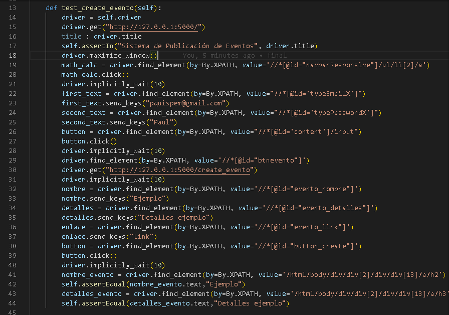

# Trabajo Final de Ingenieria de Software II: Pagina Web de eventos relacionados a computacion

## Proposito del Proyecto
Debido a los grandes avances y nuevas tecnologias relevantes para la sociedad de computacion que comprende entre investigadores, profesores, empresas, estudiantes y demas personas aficionados; esta pagina web pretende ser util para que los ponentes puedan notificar de sus proximos eventos a traves de una interfaz simple, y asi estos puedan mostrar mas interes a los temas tratados y agrandar la comunidad de ciencia de la computacion.

## Herramientas

-GitHub: Se utilizó para crear un repositorio donde alojar el proyecto. 
-JMeter: Es ua herramienta medir el rendimiento de una aplicación 
-SonarQube: Es una plataforma para evaluar código fuente. Es software libre y usa diversas herramientas de análisis estático de código fuente como Checkstyle, PMD o FindBugs para obtener métricas que pueden ayudar a mejorar la calidad del código de un programa. 
-Sonar-scanner  
-Unittest: Es un una libreria de programación para hacer pruebas unitarias, es el estándar de facto para las pruebas unitarias de una aplicación Python. Aunque, es popular para las pruebas unitarias, tiene soporte completo y provisión para pruebas de instrumentación también.  
-OWASP ZAP  
-Selenium: Es un entorno de pruebas de software para aplicaciones basadas en la web. Selenium provee una herramienta de grabar/reproducir para crear pruebas sin usar un lenguaje de scripting para pruebas.  

## Funcionalidades
La pagina web presenta entre sus principales funcionalidades:

### - Visualizar a traves de una interfaz grafica eventos relacionados a la computacion

### - Obtener mas informacion de los eventos

### - Acceder a los perfiles de los ponentes

### - Login

### - Register

### - Crear eventos

  
## Github
Cada integrante ha creado su propia rama con su nombre sobre la cual ha trabajado y se ha realizado integracion continua sobre la rama de **Desarrollo** en la cual se realizan las diferentes pruebas tanto unitarias, funcionales, de rendimiento, de seguridad y el analisis estatico.

# Instalación

##### - Clonar o descargar el proyecto del repositorio

`git clone https://github.com/PaulJisus/Proyecto-IS-II.git`

##### - Crear un entorno virtual para posteriormente instalar las librerias del proyecto

- `python3 -m venv venv` (Windows)
-  `virtualenv venv -ppython3` (Linux)

##### - Activar el entorno virtual de nuestro proyecto

- `cd venv\Scripts\activate.bat` (Windows)
- `source venv/bin/active` (Linux)

##### - Instalar todas las librerias del proyecto

- `pip install -r requirements.txt`

#### - Ejecutar flask

- `flask run`

#### - Ir al destino:

http://127.0.0.1:5000

## Pipeline en Jenkins
Para realizar el procedimiento completo de integración continua es necesario trabajar con Jenkins. Por ello se ha creado un pipeline con el siguiente script

## Construcción automática
En Python el tema de construcción automática no necesita de comandos específicos, pero si requiere un archivo requirements.txt el cual gaurdara todas las librerias usadas para el proyecto. Es necesario que para usarlo de forma correcta se use docker o un entorno virtual en python, de manera que solo se almacenen las librerias necesarias.

## Analisis Estático
-SonarQube official Plugin  
-SonarScanner Plugin  
-Sonar Qube Server  
-sonar-project.properties  

## Antes del Refactoring

## Previsualización del análisis de Sonar Scanner

## Vulnerabilidades

## Code Smells

## Bugs

## Después del Refactoring

## Pruebas unitarias
Para las pruebas unitarias se ha utilizado la librería de unittest
Algunos ejemplos de test usados: 

Y este este es el resultado obtenido de haber corrido todos los test unitarios. Con la libreria unittest la forma de declarar que se ha pasado un test es con un punto y que ha fallado con la letra F.  

## Pruebas funcionales
Para las pruebas funcionales se ha hecho uso de selenium  

Y el resultado seria  

## Pruebas de seguridad
Para la pruebas de seguridad se ha hecho uso de Owasp zap
# Contenidos
 

##Sobre el reporte
 

##Sumario

 
 
 

##Apendice

 

## Pruebas de rendimiento
## Requisitos

- Jmeter
- Paths (JMeter, Proyecto, Output y URL)

Para esta sección se uso la herramienta JMeter para hacer las pruebas de rendimiento en el proyecto. 

Se inicio un plan de pruebas, con grupos de hilos y su respectivo HTTP.

Al finalizar generar un HTTP report del proyecto en JMeter, el cual nos dara un informe completo de este. 

## Gestion de issues  
La gestion de Issues se ha realizado en Trello. 

## Integrantes :

-Jhonathan Clavijo Chacaltan 
